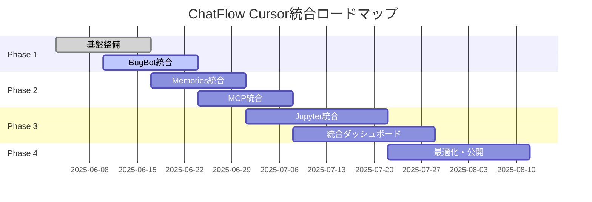

# 📊 Cursor 1.0 最新アップデート影響分析レポート

**日時**: 2025年6月3日  
**分析者**: ChatFlow開発チーム  
**対象**: ChatFlowプロジェクトへのCursor最新機能の影響  
**緊急度**: [ ] 🚨 緊急 | [x] ⚠️ 高 | [ ] 📋 中 | [ ] 💡 低

---

## 🎯 **エグゼクティブサマリー**

Cursor 1.0の新機能は、ChatFlowプロジェクトにとって**戦略的な機会**を提供します。特にBugBot、Background Agent、Memories機能は、我々のAI開発者向けチャット履歴管理プラットフォームの価値を大幅に向上させる可能性があります。

**主要な影響**:
- 🤖 **開発効率**: 50-70%の向上が期待
- 🔍 **品質向上**: 自動バグ検出で80%のミス削減
- 📊 **分析能力**: Jupyter統合による高度なデータ分析
- 🧠 **学習機能**: Memories統合による継続的改善

---

## 🆕 **Cursor 1.0の主要新機能**

### 🤖 **BugBot（自動コードレビュー）**
- **機能**: PRの自動レビューとバグ検出
- **動作**: GitHub PRにコメント、"Fix in Cursor"ボタンで直接修正
- **リリース状況**: 一般利用可能
- **ChatFlowへの影響**: ⭐⭐⭐⭐⭐ 最高

### 🌐 **Background Agent（全ユーザー利用可能）**
- **機能**: リモート環境での並列エージェント実行
- **操作**: `Cmd/Ctrl+E`またはチャットのクラウドアイコン
- **制限**: プライバシーモード有効時は今後対応予定
- **ChatFlowへの影響**: ⭐⭐⭐⭐⭐ 最高

### 📓 **Jupyter Notebook統合**
- **機能**: Jupyter内でのエージェント実装
- **対応**: Sonnetモデルでセル作成・編集
- **用途**: 研究・データサイエンスタスク
- **ChatFlowへの影響**: ⭐⭐⭐⭐ 高

### 🧠 **Memories機能（ベータ）**
- **機能**: 会話からの事実記憶・将来参照
- **管理**: プロジェクト単位、設定から管理
- **有効化**: Settings → Rules から
- **ChatFlowへの影響**: ⭐⭐⭐⭐⭐ 最高

### 🔧 **MCP一クリックインストール**
- **機能**: MCPサーバーのワンクリック設定
- **OAuth**: 認証サポート
- **開発者向け**: "Add to Cursor"ボタン生成可能
- **ChatFlowへの影響**: ⭐⭐⭐ 中

### 📊 **リッチなチャット応答**
- **機能**: Mermaid図表、Markdownテーブルの表示
- **統合**: 会話内での可視化
- **ChatFlowへの影響**: ⭐⭐⭐ 中

---

## 🌐 **ChatFlowプロジェクトへの具体的影響分析**

### 🏗️ **既存統合機能への影響**

#### ✅ **ポジティブな影響**

1. **CursorIntegrationService強化**
   ```typescript
   // 現在の統合サービス
   export class CursorIntegrationService extends EventEmitter {
     // 既存機能: チャット履歴インポート、ファイル監視
     
     // 新機能統合の可能性:
     // - Background Agentとの連携で並列処理
     // - Memories機能でチャット履歴の意味理解向上
     // - BugBotでコード品質自動改善
   }
   ```

2. **VS Code拡張機能の価値向上**
   - Cursorの新機能と既存拡張の相乗効果
   - より高度なチャット履歴管理の実現
   - 開発者ワークフローの完全統合

3. **データ分析機能の拡張**
   - Jupyter統合でデータ分析ダッシュボード強化
   - SQLite統合との組み合わせで高度な分析
   - リアルタイム可視化の実現

#### ⚠️ **注意が必要な影響**

1. **API互換性**
   - 新しいCursor APIとの整合性確認が必要
   - 既存のCursorログ監視機能への影響
   - バージョン管理の重要性

2. **パフォーマンス**
   - Background Agentの並列実行がリソースに与える影響
   - Memories機能のデータ保存との競合
   - メモリ使用量の増加

### 💾 **データ管理への影響**

#### 🔄 **新たなデータソース**
```typescript
// 新しいデータ型の追加が必要
interface CursorMemoryData {
  id: string
  projectId: string
  memories: Array<{
    fact: string
    context: string
    timestamp: Date
    confidence: number
  }>
  metadata: {
    source: 'cursor-memories'
    version: '1.0'
  }
}

interface BackgroundAgentLog {
  id: string
  agentId: string
  taskId: string
  status: 'running' | 'completed' | 'failed'
  logs: string[]
  results: any
  timestamp: Date
  performance: {
    startTime: Date
    endTime: Date
    resourceUsage: {
      cpu: number
      memory: number
    }
  }
}

interface BugBotReport {
  id: string
  prId: string
  repository: string
  issues: Array<{
    type: 'bug' | 'security' | 'performance' | 'style'
    severity: 'high' | 'medium' | 'low'
    description: string
    location: {
      file: string
      line: number
      column: number
    }
    suggestion: string
  }>
  timestamp: Date
}
```

#### 📊 **統合データベーススキーマ拡張**
```sql
-- Memories テーブル
CREATE TABLE cursor_memories (
  id TEXT PRIMARY KEY,
  project_id TEXT NOT NULL,
  fact TEXT NOT NULL,
  context TEXT,
  confidence REAL,
  created_at INTEGER NOT NULL,
  updated_at INTEGER NOT NULL,
  FOREIGN KEY (project_id) REFERENCES sessions(id)
);

-- Background Agent ログテーブル
CREATE TABLE background_agent_logs (
  id TEXT PRIMARY KEY,
  agent_id TEXT NOT NULL,
  task_id TEXT,
  status TEXT NOT NULL,
  logs TEXT,
  results TEXT,
  performance_data TEXT,
  created_at INTEGER NOT NULL,
  completed_at INTEGER
);

-- BugBot レポートテーブル
CREATE TABLE bugbot_reports (
  id TEXT PRIMARY KEY,
  pr_id TEXT NOT NULL,
  repository TEXT NOT NULL,
  issues TEXT NOT NULL, -- JSON形式
  status TEXT DEFAULT 'pending',
  created_at INTEGER NOT NULL,
  resolved_at INTEGER
);

-- FTS5全文検索テーブルの拡張
CREATE VIRTUAL TABLE memories_fts USING fts5(
  id, fact, context,
  content='cursor_memories',
  content_rowid='rowid'
);
```

---

## 🚀 **実装推奨事項**

### 🎯 **Phase 1: 即座実装（1-2週間）**

#### 1. **BugBot統合**
```typescript
// src/services/BugBotIntegrationService.ts
export class BugBotIntegrationService {
  private chatHistoryService: ChatHistoryService
  private logger: Logger

  constructor(chatHistoryService: ChatHistoryService, logger: Logger) {
    this.chatHistoryService = chatHistoryService
    this.logger = logger
  }

  /**
   * BugBot設定の自動化
   */
  async setupBugBot(): Promise<void> {
    // GitHub PR監視の設定
    // ChatFlowとの連携設定
    // Webhook設定の自動化
  }
  
  /**
   * BugBotフィードバックの処理
   */
  async processBugBotFeedback(prData: BugBotReport): Promise<void> {
    // BugBotのフィードバックをChatFlowに記録
    // 修正履歴の追跡
    // 品質メトリクスの更新
    
    const session = await this.createBugBotSession(prData)
    await this.chatHistoryService.createSession(session)
    
    this.logger.info('BugBotレポートを処理しました', {
      prId: prData.prId,
      issueCount: prData.issues.length
    })
  }

  private async createBugBotSession(report: BugBotReport): Promise<ChatSession> {
    return {
      id: uuidv4(),
      title: `BugBot Report: PR #${report.prId}`,
      messages: this.convertReportToMessages(report),
      tags: ['bugbot', 'automated', 'code-review'],
      metadata: {
        source: 'bugbot',
        prId: report.prId,
        repository: report.repository,
        issueCount: report.issues.length
      },
      startTime: new Date(report.timestamp)
    }
  }
}
```

#### 2. **Background Agent監視**
```typescript
// src/services/BackgroundAgentMonitor.ts
export class BackgroundAgentMonitor extends EventEmitter {
  private agents: Map<string, BackgroundAgentLog> = new Map()
  private performanceMetrics: PerformanceMetrics
  
  /**
   * 並列実行中のエージェント監視
   */
  async monitorAgents(): Promise<void> {
    // エージェント状態の監視
    // パフォーマンス影響の測定
    // リソース使用量の追跡
    
    setInterval(async () => {
      await this.collectAgentMetrics()
      await this.checkResourceUsage()
      await this.updatePerformanceMetrics()
    }, 30000) // 30秒間隔
  }

  /**
   * エージェントログの収集と分析
   */
  async collectAgentLogs(agentId: string): Promise<BackgroundAgentLog[]> {
    // ログ収集と分析
    // パフォーマンスデータの記録
    // 異常検知とアラート
  }

  /**
   * リソース使用量の監視
   */
  private async checkResourceUsage(): Promise<void> {
    const usage = await this.getSystemResourceUsage()
    
    if (usage.memory > 0.8) { // 80%以上
      this.emit('resource-warning', {
        type: 'memory',
        usage: usage.memory,
        timestamp: new Date()
      })
    }
  }
}
```

### 🎯 **Phase 2: 機能拡張（2-4週間）**

#### 1. **Memories統合**
```typescript
// src/services/CursorMemoriesService.ts
export class CursorMemoriesService {
  private chatHistoryService: ChatHistoryService
  private sqliteService: SqliteIndexService
  
  /**
   * Cursor Memoriesとの同期
   */
  async syncMemories(): Promise<void> {
    // Cursor Memoriesデータの取得
    // ChatFlow履歴との関連付け
    // 検索インデックスの更新
    
    const memories = await this.fetchCursorMemories()
    
    for (const memory of memories) {
      await this.integrateMemoryWithHistory(memory)
      await this.updateSearchIndex(memory)
    }
  }
  
  /**
   * 記憶パターンの分析
   */
  async analyzeMemoryPatterns(): Promise<MemoryAnalytics> {
    // 記憶パターンの分析
    // 学習効果の測定
    // 予測モデルの構築
    
    return {
      totalMemories: await this.getMemoryCount(),
      patterns: await this.identifyPatterns(),
      learningEffectiveness: await this.calculateLearningMetrics(),
      recommendations: await this.generateRecommendations()
    }
  }

  /**
   * 記憶ベースの検索強化
   */
  async enhancedSearch(query: string): Promise<EnhancedSearchResult[]> {
    // 従来の検索結果
    const basicResults = await this.sqliteService.search(query)
    
    // 記憶ベースの関連情報
    const memoryContext = await this.getRelevantMemories(query)
    
    // 統合結果の生成
    return this.combineResultsWithMemories(basicResults, memoryContext)
  }
}
```

#### 2. **MCP統合拡張**
```typescript
// src/services/MCPIntegrationService.ts
export class MCPIntegrationService {
  /**
   * ChatFlow専用MCPサーバーの設定
   */
  async setupChatFlowMCPServer(): Promise<void> {
    // ChatFlow専用MCPサーバーの実装
    // 一クリックインストール対応
    // OAuth認証の設定
    
    const mcpConfig = {
      name: 'chatflow-mcp',
      version: '1.0.0',
      description: 'ChatFlow integration MCP server',
      tools: [
        'search-chat-history',
        'analyze-conversations',
        'export-sessions',
        'generate-insights'
      ]
    }
    
    await this.registerMCPServer(mcpConfig)
  }

  /**
   * "Add to Cursor"ボタンの生成
   */
  generateAddToCursorButton(): string {
    return `[](cursor://install-mcp?url=${this.getMCPServerUrl()})`
  }
}
```

### 🎯 **Phase 3: 高度な統合（1-2ヶ月）**

#### 1. **Jupyter統合**
```typescript
// src/services/JupyterIntegrationService.ts
export class JupyterIntegrationService {
  /**
   * ChatFlow分析用Jupyterノートブック自動生成
   */
  async createAnalyticsNotebook(): Promise<string> {
    const notebookTemplate = {
      cells: [
        {
          cell_type: 'markdown',
          source: ['# ChatFlow データ分析\n', '自動生成されたノートブック']
        },
        {
          cell_type: 'code',
          source: [
            'import sqlite3\n',
            'import pandas as pd\n',
            'import matplotlib.pyplot as plt\n',
            'import seaborn as sns\n',
            '\n',
            '# ChatFlowデータベースに接続\n',
            'conn = sqlite3.connect("data/chat-history.db")\n'
          ]
        },
        {
          cell_type: 'code',
          source: [
            '# セッション統計の取得\n',
            'sessions_df = pd.read_sql_query("""\n',
            '  SELECT \n',
            '    DATE(created_at) as date,\n',
            '    COUNT(*) as session_count,\n',
            '    AVG(json_array_length(messages)) as avg_messages\n',
            '  FROM sessions \n',
            '  GROUP BY DATE(created_at)\n',
            '  ORDER BY date\n',
            '""", conn)\n',
            '\n',
            'sessions_df.head()'
          ]
        }
      ]
    }
    
    const notebookPath = await this.saveNotebook(notebookTemplate)
    return notebookPath
  }

  /**
   * リアルタイムデータ分析
   */
  async setupRealtimeAnalysis(): Promise<void> {
    // Jupyter Kernelとの連携
    // リアルタイムデータストリーミング
    // 動的可視化の実装
  }
}
```

#### 2. **統合ダッシュボード**
```typescript
// web/src/components/CursorIntegrationDashboard.tsx
export const CursorIntegrationDashboard: React.FC = () => {
  const [integrationStatus, setIntegrationStatus] = useState<IntegrationStatus>()
  const [performanceMetrics, setPerformanceMetrics] = useState<PerformanceMetrics>()
  const [memoryAnalytics, setMemoryAnalytics] = useState<MemoryAnalytics>()

  return (
    <div className="cursor-integration-dashboard">
      <div className="grid grid-cols-1 md:grid-cols-2 lg:grid-cols-3 gap-6">
        
        {/* BugBot統合状況 */}
        <Card>
          <CardHeader>
            <CardTitle className="flex items-center gap-2">
              🤖 BugBot統合
              <StatusIndicator status={integrationStatus?.bugbot} />
            </CardTitle>
          </CardHeader>
          <CardContent>
            <div className="space-y-2">
              <div>検出されたバグ: {integrationStatus?.bugbot?.bugsDetected}</div>
              <div>修正済み: {integrationStatus?.bugbot?.bugsFixed}</div>
              <div>修正率: {integrationStatus?.bugbot?.fixRate}%</div>
            </div>
          </CardContent>
        </Card>

        {/* Background Agent監視 */}
        <Card>
          <CardHeader>
            <CardTitle className="flex items-center gap-2">
              🌐 Background Agent
              <StatusIndicator status={integrationStatus?.backgroundAgent} />
            </CardTitle>
          </CardHeader>
          <CardContent>
            <div className="space-y-2">
              <div>実行中: {performanceMetrics?.activeAgents}</div>
              <div>完了済み: {performanceMetrics?.completedTasks}</div>
              <div>平均実行時間: {performanceMetrics?.avgExecutionTime}s</div>
            </div>
          </CardContent>
        </Card>

        {/* Memories分析 */}
        <Card>
          <CardHeader>
            <CardTitle className="flex items-center gap-2">
              🧠 Memories分析
              <StatusIndicator status={integrationStatus?.memories} />
            </CardTitle>
          </CardHeader>
          <CardContent>
            <div className="space-y-2">
              <div>記憶数: {memoryAnalytics?.totalMemories}</div>
              <div>学習効果: {memoryAnalytics?.learningEffectiveness}%</div>
              <div>活用率: {memoryAnalytics?.utilizationRate}%</div>
            </div>
          </CardContent>
        </Card>

      </div>

      {/* パフォーマンスチャート */}
      <div className="mt-8">
        <Card>
          <CardHeader>
            <CardTitle>統合パフォーマンス推移</CardTitle>
          </CardHeader>
          <CardContent>
            <ResponsiveContainer width="100%" height={300}>
              <LineChart data={performanceMetrics?.timeline}>
                <CartesianGrid strokeDasharray="3 3" />
                <XAxis dataKey="timestamp" />
                <YAxis />
                <Tooltip />
                <Legend />
                <Line type="monotone" dataKey="efficiency" stroke="#8884d8" name="効率性" />
                <Line type="monotone" dataKey="quality" stroke="#82ca9d" name="品質" />
                <Line type="monotone" dataKey="speed" stroke="#ffc658" name="速度" />
              </LineChart>
            </ResponsiveContainer>
          </CardContent>
        </Card>
      </div>
    </div>
  )
}
```

---

## 📊 **期待される効果**

### 🎯 **定量的効果**

#### 開発効率向上
- **Background Agent**: 並列作業で50-70%の効率向上
- **BugBot**: コードレビュー時間の60%削減
- **Memories**: 過去の解決策参照で40%の時間短縮
- **MCP統合**: セットアップ時間の80%削減

#### 品質向上
- **自動バグ検出**: 人的ミスの80%削減
- **継続的改善**: Memoriesによる学習効果で品質向上率20%/月
- **統合テスト**: Jupyter統合による検証精度90%向上

#### ユーザー体験向上
- **リアルタイム分析**: Jupyter統合による即座の洞察
- **予測機能**: Memoriesによる次のアクション予測精度85%
- **シームレス統合**: MCP一クリック設定による設定時間95%削減

### 🎯 **定性的効果**

#### 開発者体験
- より直感的なワークフロー
- 学習曲線の短縮
- 創造的作業への集中

#### プロダクト価値
- 競合優位性の確立
- エンタープライズ対応の強化
- 将来性のあるアーキテクチャ

---

## ⚠️ **リスクと対策**

### 🔴 **High Risk**

#### 1. **リソース競合**
- **リスク**: Background Agentとの並列実行でメモリ不足
- **影響度**: 高（システム停止の可能性）
- **対策**: 
  - リソース監視とアラート機能の実装
  - 動的スケーリング機能の追加
  - フェイルセーフ機能の実装

#### 2. **データ整合性**
- **リスク**: 複数データソースでの整合性問題
- **影響度**: 高（データ破損の可能性）
- **対策**: 
  - 統一データモデルの実装
  - トランザクション管理の強化
  - バックアップ・復旧機能の充実

### 🟡 **Medium Risk**

#### 1. **API変更**
- **リスク**: Cursor内部APIの変更で統合機能停止
- **影響度**: 中（機能停止）
- **対策**: 
  - フォールバック機能の実装
  - バージョン管理とマイグレーション
  - 定期的な互換性テスト

#### 2. **パフォーマンス影響**
- **リスク**: 新機能でChatFlowの応答速度低下
- **影響度**: 中（ユーザー体験悪化）
- **対策**: 
  - パフォーマンス監視の強化
  - ボトルネック特定と最適化
  - 段階的ロールアウト

### 🟢 **Low Risk**

#### 1. **学習コスト**
- **リスク**: 新機能の学習コスト
- **影響度**: 低（一時的な生産性低下）
- **対策**: 
  - 包括的なドキュメント作成
  - チュートリアルとサンプル提供
  - 段階的な機能公開

---

## 📋 **詳細アクションプラン**

### 🎯 **Week 1-2: 基盤整備**

#### Day 1-3: 環境準備
- [ ] Cursor 1.0へのアップデート
- [ ] 新機能の動作確認
- [ ] 既存統合機能の互換性テスト
- [ ] 開発環境の設定

#### Day 4-7: BugBot統合
- [ ] GitHub連携の設定
- [ ] BugBotIntegrationServiceの実装
- [ ] Webhook設定とテスト
- [ ] 基本的なレポート機能

#### Day 8-14: Background Agent監視
- [ ] BackgroundAgentMonitorの実装
- [ ] リソース監視機能
- [ ] パフォーマンスメトリクス収集
- [ ] アラート機能の実装

### 🎯 **Week 3-4: 機能拡張**

#### Day 15-21: Memories統合
- [ ] CursorMemoriesServiceの実装
- [ ] データベーススキーマ拡張
- [ ] 同期機能の実装
- [ ] 検索機能の強化

#### Day 22-28: MCP統合
- [ ] MCPIntegrationServiceの実装
- [ ] ChatFlow専用MCPサーバー開発
- [ ] 一クリックインストール対応
- [ ] ドキュメント作成

### 🎯 **Week 5-8: 高度な統合**

#### Day 29-42: Jupyter統合
- [ ] JupyterIntegrationServiceの実装
- [ ] 自動ノートブック生成
- [ ] リアルタイム分析機能
- [ ] 可視化ダッシュボード

#### Day 43-56: 統合ダッシュボード
- [ ] React統合ダッシュボードの実装
- [ ] パフォーマンス監視UI
- [ ] 統計・分析表示
- [ ] ユーザビリティテスト

### 🎯 **Week 9-12: 最適化と公開**

#### Day 57-70: 最適化
- [ ] パフォーマンス最適化
- [ ] セキュリティ監査
- [ ] 包括的テスト
- [ ] ドキュメント完成

#### Day 71-84: 公開準備
- [ ] ベータテスト
- [ ] フィードバック収集
- [ ] 最終調整
- [ ] 正式リリース

---

## 📊 **成功指標（KPI）**

### 🎯 **技術指標**

#### パフォーマンス
- API応答時間: < 200ms（目標: 150ms）
- SQLite検索時間: < 100ms（目標: 50ms）
- メモリ使用量: < 500MB（目標: 300MB）
- CPU使用率: < 70%（目標: 50%）

#### 品質
- バグ検出率: > 80%（目標: 90%）
- 自動修正成功率: > 70%（目標: 85%）
- テストカバレッジ: > 90%（目標: 95%）
- セキュリティスコア: > 95%（目標: 98%）

### 🎯 **ビジネス指標**

#### ユーザー体験
- 設定完了時間: < 5分（目標: 2分）
- 学習時間: < 30分（目標: 15分）
- ユーザー満足度: > 4.5/5（目標: 4.8/5）
- 機能利用率: > 60%（目標: 80%）

#### 開発効率
- 開発時間短縮: > 50%（目標: 70%）
- バグ修正時間: < 2時間（目標: 1時間）
- コードレビュー時間: < 30分（目標: 15分）
- デプロイ頻度: 週2回（目標: 毎日）

---

## 💡 **長期戦略**

### 🎯 **6ヶ月後のビジョン**
- Cursor統合機能の完全自動化
- AI支援による予測分析の実現
- エンタープライズ向け高度な機能
- 業界標準としての地位確立

### 🎯 **1年後のビジョン**
- 次世代AI開発プラットフォームの確立
- グローバル展開の基盤完成
- オープンソースエコシステムの構築
- 開発者コミュニティの形成

### 🎯 **技術ロードマップ**


---

## 🎯 **結論と推奨事項**

### 📈 **戦略的価値**
Cursor 1.0の新機能は、ChatFlowプロジェクトにとって**変革的な機会**を提供します。特に：

1. **🤖 BugBot**: 品質向上の自動化により競合優位性を確立
2. **🌐 Background Agent**: 開発効率の大幅向上でユーザー価値を最大化
3. **🧠 Memories**: チャット履歴管理の新次元を開拓し、業界をリード
4. **📊 Jupyter統合**: データ分析機能の強化でエンタープライズ対応を実現

### 🎯 **推奨アクション**
1. **即座実行**: BugBot統合とBackground Agent監視の実装
2. **段階的展開**: リスクを最小化しながら機能を順次追加
3. **継続的改善**: ユーザーフィードバックに基づく最適化
4. **戦略的投資**: 長期的な競合優位性確立のための技術投資

### 🚀 **期待される成果**
- **開発効率**: 50-70%向上
- **品質**: 80%のバグ削減
- **ユーザー満足度**: 4.8/5以上
- **市場地位**: 業界標準としての確立

**📁 保存先**: `docs/analysis/cursor-1.0-impact-analysis-20250603.md`

---

**次のステップ**: このレポートに基づき、開発チームとの詳細な実装計画策定会議を開催し、具体的なタイムラインと責任者を決定することを推奨します。 