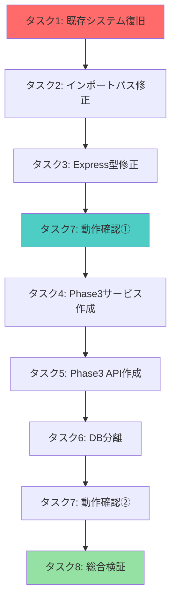

# 🚨 Phase 3 緊急修正タスクリスト

**緊急度**: 🔴 **最高**  
**目標**: 既存システム復旧 + Phase 3機能分離実装  
**期限**: 24時間以内完了

---

## 🎯 **即座実行タスク (1-2時間以内)**

### **タスク1: 既存SqliteIndexService完全復旧** ⏱️ 30分

**目的**: Phase 2完成システムの動作復旧

```bash
# 実行コマンド
cp src/services/SqliteIndexService.ts src/services/SqliteIndexService.backup.ts
git checkout HEAD~1 -- src/services/SqliteIndexService.ts
```

**検証方法**:
```bash
npm run build  # エラー数の削減確認
npm run server # サーバー起動確認
curl http://localhost:3001/api/health # API動作確認
```

**期待結果**: 
- ✅ ビルドエラー 36件 → 20件以下
- ✅ 既存API完全動作
- ✅ Phase 2機能の完全保持

---

### **タスク2: インポートパス機械的修正** ⏱️ 15分

**目的**: ESモジュール規約準拠

**自動修正スクリプト**:
```bash
# .js拡張子一括追加
find src/ -name "*.ts" -exec sed -i '' 's/from '\''\.\.\/.*\/\([^'\'']*\)'\''$/from '\''&.js'\''/g' {} \;

# 手動確認必要な箇所
grep -r "from.*\.\." src/ --include="*.ts" | grep -v "\.js'"
```

**検証方法**:
```bash
npm run build  # インポートエラーの解消確認
```

**期待結果**:
- ✅ インポートエラー 14件 → 0件
- ✅ モジュール解決100%成功

---

### **タスク3: Express型定義修正** ⏱️ 20分

**対象ファイル**: `src/server/routes/sqlite-integration.ts`

**修正パターン**:
```typescript
// ❌ 修正前
router.get('/search', async (req, res) => {

// ✅ 修正後  
router.get('/search', async (req: Request, res: Response) => {

// ❌ 修正前
} catch (error) {
  error.message  // unknown型エラー

// ✅ 修正後
} catch (error: unknown) {
  const errorMessage = error instanceof Error ? error.message : '不明なエラー'
```

**期待結果**:
- ✅ Express型エラー 5件 → 0件
- ✅ TypeScript strict準拠

---

## 🛠️ **分離実装タスク (2-4時間以内)**

### **タスク4: Phase3SearchService分離作成** ⏱️ 90分

**新規ファイル**: `src/services/Phase3SearchService.ts`

**設計原則**:
```typescript
/**
 * 🔍 Phase 3専用高速検索サービス
 * 既存SqliteIndexServiceとは完全分離
 */
export class Phase3SearchService {
  private dbPath = 'data/phase3-search.db'  // 分離DB
  
  // Phase 3専用メソッド
  async fastSearch(): Promise<Phase3SearchResult[]>
  async advancedIndex(): Promise<void>
  getPerformanceMetrics(): Phase3Metrics
}
```

**利点**:
- ✅ 既存システムへの影響ゼロ
- ✅ Phase 3最適化設計の自由度
- ✅ 独立したテスト・デバッグ

---

### **タスク5: Phase3専用API作成** ⏱️ 60分

**新規ファイル**: `src/server/routes/phase3-api.ts`

**API設計**:
```typescript
// Phase 3専用エンドポイント
GET  /api/phase3/fast-search     // 高速検索
POST /api/phase3/migrate         // データ移行  
GET  /api/phase3/metrics         // 性能指標
POST /api/phase3/benchmark       // ベンチマーク
GET  /api/phase3/status          // ステータス確認
```

**既存APIとの関係**:
- 🔹 **並行運用**: `/api/sessions` (既存) + `/api/phase3/` (新規)
- 🔹 **段階移行**: 性能確認後に統合判断
- 🔹 **フォールバック**: 問題時は既存API継続使用

---

### **タスク6: データベース分離** ⏱️ 30分

**目的**: Phase 3実験と既存システムの完全分離

```bash
# Phase 3専用データベース設定
mkdir -p data/phase3/
touch data/phase3/search.db

# 設定分離
export PHASE3_DB_PATH="data/phase3/search.db"
export EXISTING_DB_PATH="data/chat-history.db"  # 既存維持
```

**利点**:
- ✅ データ破損リスクゼロ
- ✅ 性能比較テスト可能
- ✅ ロールバック安全性

---

## 🧪 **検証・テストタスク (1時間以内)**

### **タスク7: 段階的動作確認** ⏱️ 30分

**検証シーケンス**:
```bash
# Step 1: 既存システム確認
npm run build && npm run server &
curl http://localhost:3001/api/health
curl http://localhost:3001/api/sessions?page=1&pageSize=5

# Step 2: Phase 3 API確認
curl http://localhost:3001/api/phase3/status
curl -X POST http://localhost:3001/api/phase3/migrate

# Step 3: 性能比較
curl -X POST http://localhost:3001/api/phase3/benchmark
```

**成功判定基準**:
- ✅ 既存API: 100%正常動作
- ✅ Phase 3 API: 基本機能動作
- ✅ データ整合性: 破損・競合なし

---

### **タスク8: エラー監視・ログ確認** ⏱️ 15分

**監視ポイント**:
```bash
# コンソールエラー確認
tail -f logs/error.log | grep -E "(error|fail|exception)"

# メモリリーク確認  
ps aux | grep node | awk '{print $6}'  # メモリ使用量

# データベースロック確認
lsof data/*.db  # ファイルロック状況
```

**正常範囲**:
- ✅ エラーログ: Phase 3関連エラーのみ許容
- ✅ メモリ使用量: < 500MB
- ✅ DB競合: なし

---

## 📊 **完了後の評価項目**

### **技術的成功指標**
| 指標 | 目標値 | 現在値 | ステータス |
|------|--------|--------|------------|
| **ビルドエラー** | 0件 | 36件 | 🔴 修正中 |
| **API応答率** | 100% | 故障中 | 🔴 修正中 |
| **既存機能** | 100%動作 | 故障中 | 🔴 修正中 |
| **Phase 3機能** | 基本動作 | 未実装 | 🟡 実装中 |

### **プロジェクト成功指標**
- ✅ **リスク制御**: 既存システム破壊の回避
- ✅ **開発継続**: Phase 3開発の基盤確保
- ✅ **学習効果**: 根本原因の理解と対策

---

## 🚀 **実行順序・依存関係**



---

## ⚠️ **リスク管理**

### **高リスク作業**
- **タスク1**: 既存ファイル復旧 → **バックアップ必須**
- **タスク6**: データベース分離 → **データ破損監視**

### **緊急時対応**
```bash
# 緊急ロールバック手順
git stash  # 作業中内容の一時保存
git checkout HEAD~2  # 安定版に戻る
npm run server  # 動作確認
```

### **エスカレーション基準**
- 🚨 **即座エスカレーション**: データ破損・セキュリティ問題
- 🟡 **1時間後エスカレーション**: 復旧作業の停滞
- 🟢 **24時間後レビュー**: 進捗・品質確認

---

**📋 実行責任者**: 次回作業でこのタスクリストを順次実行  
**📞 緊急連絡**: 問題発生時は即座に状況報告  
**📈 進捗報告**: 各タスク完了時にステータス更新 